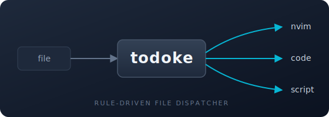

#  todoke

<p align="center">
  
</p>

<p align="center">
  <b>A rule-driven file dispatcher that hands incoming paths to the right editor or script — <i>届け</i>.</b>
</p>

<p align="center">
  <a href="https://crates.io/crates/todoke"></a>
  <a href="https://github.com/yukimemi/todoke/actions"></a>
  <a href="./LICENSE"></a>
</p>

```
┌──────┐       ┌────────┐       ╭──▶ nvim
│ file │ ──▶   │ todoke │ ──▶   ├──▶ code
└──────┘       └────────┘       ╰──▶ script / …
```

`todoke` takes one or more file paths and decides what to do with each of
them — by regex-matching the path against a TOML ruleset. A rule can target
a long-running neovim (reused via msgpack-RPC), any generic CLI editor, or a
raw shell script. Perfect as your OS default program for text files, as
`$EDITOR`, or as a standalone file handler.

It is the successor to [`edtr`][edtr] / [`hitori.vim`][hitori], generalized
from "editor router" into a full rule-driven dispatcher.

## Features

- **Rule-based routing**: regex patterns in TOML decide what handles each
  file. Different paths → different handlers (VSCode for one project, nvim
  for another, a shell script for a third).
- **Single-instance neovim** via named pipes / unix sockets: `todoke`
  connects to a running nvim and sends `:edit` over msgpack-RPC. Works on
  Windows via `\\.\pipe\...` — no Deno, no plugin framework, no cold start.
- **Sync or async** per rule: `sync = true` blocks until the handler exits
  (perfect for `git commit`), `sync = false` fires and forgets (perfect for
  double-clicking files in the OS file explorer).
- **Tera templating** throughout the config: `{{ file_path }}`,
  `{{ env.HOME }}`, `…`, structural
  conditionals that include whole editor / rule blocks, every Tera filter.
- **Generic CLI support**: any command-line tool works (`code`, `vim`,
  `helix`, `subl`, `emacsclient`, `bat`, `pandoc`, …) without custom code.
- **`edtr` compatibility**: same embedded default config, same config
  schema. Existing `edtr` users migrate by renaming the config directory
  (see below).
- **Fast**: static Rust binary, cold start in milliseconds. On Windows this
  is often 10–100× faster than denops-based alternatives.

## Install

```sh
cargo install todoke
```

Binary lives at `~/.cargo/bin/todoke`. Make sure that's on your `PATH`.

## Quick start

`todoke` works out of the box with a bundled default config — it routes
everything to a single shared neovim instance, except `$EDITOR`-callback
files (`COMMIT_EDITMSG` etc.) which always get a fresh `sync = true`
instance so `git commit` works.

To customize, drop a file at:

- Linux / macOS / Windows: `~/.config/todoke/todoke.toml`

Minimal example:

```toml
# ~/.config/todoke/todoke.toml

# kind = "neovim" opts into msgpack-RPC reuse; "exec" (default) just spawns.
[todoke.nvim]
kind = "neovim"
command = "nvim"
listen = '\\.\pipe\nvim-todoke-{{ group }}/tmp/nvim-todoke-{{ group }}.sock'

[todoke.code]
command = "code"
[todoke.code.args]
remote = ["--reuse-window"]
new    = ["--new-window"]

[todoke.firefox]
command = "firefox"

# git commit, rebase, etc. — always a blocking fresh nvim.
[[rules]]
name = "editor-callback"
match = '(?i)/(COMMIT_EDITMSG|MERGE_MSG|git-rebase-todo)$'
to = "nvim"
mode = "new"
sync = true

# GitHub URLs → firefox
[[rules]]
name = "gh"
match = '^https?://(www\.)?github\.com/'
to = "firefox"

# Route files under ~/src/company/ to VSCode.
[[rules]]
name = "work"
match = '/src/company/'
to = "code"
mode = "remote"

# Raw strings (neither URL nor existing file) also fall through to rules —
# capture groups are available to the handler as `{{ cap.1 }}` / `{{ cap.name }}`.
[[rules]]
name = "gh-issue"
match = '^issue:(\d+)$'
to = "firefox"

[todoke.firefox]
command = "firefox"
args.default = ["https://github.com/yukimemi/todoke/issues/{{ cap.1 }}"]

# Default: everything else goes to the shared nvim.
[[rules]]
name = "default"
match = '.*'
to = "nvim"
group = "default"
mode = "remote"
```

Then:

```sh
# Open any file in the right handler
todoke notes.md

# URLs work too — same rule engine routes them to a browser, a browser
# profile, or any CLI that accepts URLs.
todoke https://github.com/yukimemi/todoke

# Raw strings match rules too. Captures are available as {{ cap.N }}.
todoke issue:42      # → firefox opens issues/42

# Force interpretation with --as when auto-detection would get it wrong
todoke --as raw ./Cargo.toml

# See which rule would match, without actually dispatching
todoke check notes.md https://example.com issue:42

# Same dispatch logic, don't execute
todoke --dry-run notes.md

# Lint the config for common footguns
todoke doctor
```

### As `$EDITOR`

```sh
export EDITOR=todoke
git commit      # → todoke routes COMMIT_EDITMSG to nvim mode=new sync=true
```

The bundled default config is compatible with every `$EDITOR=…` caller I
know of (git, crontab, visudo, fc, mutt, …).

### As OS default program (Windows)

Right-click a `.txt` → Open with → Choose another app → Browse → point at
`todoke.exe`. `todoke` honors the rules and opens the file in the correct
handler, spawning a new console if the target is a TUI.

### Migrating from `edtr` (or todoke 0.1.x)

The schema changed in 0.2.0:

```
v0.1.x                               → v0.2.0
------------------------------------   --------------------------------
[editors.<name>]                       [todoke.<name>]
kind = "generic"                       (optional, defaults to "exec")
args_new = [...]                       [todoke.<name>.args] new = [...]
args_remote = [...]                    [todoke.<name>.args] remote = [...]
rule.editor = "..."                    rule.to = "..."
```

```sh
# Linux / macOS config dir (if still using the edtr name)
mv ~/.config/edtr ~/.config/todoke
mv ~/.config/todoke/edtr.toml ~/.config/todoke/todoke.toml

# Update env var if you set it
export EDITOR=todoke
```

`TODOKE_CONFIG` replaces `EDTR_CONFIG` as the env override.

## Configuration reference

### `[vars]`

User-defined variables available as `{{ vars.NAME }}` in every other
template:

```toml
[vars]
proj_root = "/home/me/src"
```

### `[todoke.<name>]`

A delivery target (the value behind a rule's `to = "<name>"`).

| field      | type                                | required | meaning                                                         |
| ---------- | ----------------------------------- | -------- | --------------------------------------------------------------- |
| `kind`     | `"exec"` / `"neovim"`               | no (default `"exec"`) | `"exec"` spawns the command; `"neovim"` reuses a running nvim via msgpack-RPC |
| `command`  | string                              | yes      | the handler binary (PATH-resolved)                              |
| `listen`   | string                              | neovim   | socket / named pipe path for RPC                                |
| `args`     | table of `<mode>` → `array<string>` | no       | args injected based on `rule.mode`; `args.default` is the fallback when no key matches |
| `env`      | table                               | no       | env vars passed to the spawned handler                          |

### `[[rules]]`

| field     | type                      | default      | meaning                                      |
| --------- | ------------------------- | ------------ | -------------------------------------------- |
| `name`    | string                    | `rule[N]`    | human-readable label (shown in `check`)      |
| `match`   | regex string or `[regex]` | required     | pattern(s) against the input; files are normalized to `/` before matching, URLs are matched as-is |
| `exclude` | regex string or `[regex]` | none         | when any `exclude` hits, the rule is skipped even if `match` hits — todoke falls through to the next rule |
| `to`      | string (Tera-templated)   | required     | key into `[todoke.*]`                        |
| `group`   | string                    | `"default"`  | instance identity (one nvim per group)       |
| `mode`    | string                    | `"remote"`   | free-form; `"remote"` / `"new"` are reserved for neovim behavior, otherwise used only to pick `args.<mode>` |
| `sync`    | bool                      | `false`      | `true` = block until handler exits           |

### Template context

Available in `rule.group`, `rule.to`, `todoke.*.command`, `todoke.*.listen`,
`todoke.*.args.*`:

| variable        | example                             | populated for |
| --------------- | ----------------------------------- | ------------- |
| `input`         | `/tmp/foo.md` or `https://…`        | always        |
| `input_type`    | `"file"` or `"url"`                 | always        |
| `file_path`     | `C:/Users/you/notes/todo.md`        | file inputs   |
| `file_dir`      | `C:/Users/you/notes`                | file inputs   |
| `file_name`     | `todo.md`                           | file inputs   |
| `file_stem`     | `todo`                              | file inputs   |
| `file_ext`      | `md` (no leading dot)               | file inputs   |
| `url_scheme`    | `https`                             | URL inputs    |
| `url_host`      | `github.com`                        | URL inputs    |
| `url_port`      | `443` or empty                      | URL inputs    |
| `url_path`      | `/yukimemi/todoke`                  | URL inputs    |
| `url_query`     | `tab=rs` or empty                   | URL inputs    |
| `url_fragment`  | `top` or empty                      | URL inputs    |
| `command_*`     | same five fields for the target command | always    |
| `cwd`           | current working directory           | always        |
| `group`         | resolved group                      | phase 3       |
| `rule`          | resolved rule name                  | phase 3       |
| `cap.0`         | full match of the `match` regex     | when a rule matched |
| `cap.1` / `cap.2` / … | numbered capture groups       | when defined        |
| `cap.<name>`    | named capture groups `(?P<name>…)`  | when defined        |
| `vars.<key>`    | your `[vars]` entries               | always        |
| `env.<KEY>`     | process env at todoke invocation    | always        |

And these todoke-specific Tera functions:

- `is_windows()`, `is_linux()`, `is_mac()` — booleans for OS branching.

Plus everything Tera ships — `replace`, `split`, `join`, `length`, `now()`,
structural `` / `` / `` blocks around editor
and rule sections, and all other stock [Tera features][tera].

## CLI reference

```
todoke [FILES]...            # dispatch files per rules (default action)
todoke check <FILES>...      # dry-run: show matched rule per file
todoke doctor                # lint the config for common footguns
todoke completion <shell>    # emit shell completion script
todoke --help
todoke --version

# v0.2+:
todoke list                    # list alive handler instances
todoke kill <group> | --all    # terminate instances
todoke config path | edit | validate | show
```

Flags:

- `-c, --config <PATH>` — override config path
- `-E, --editor <NAME>` — bypass rule, force handler
- `-G, --group <NAME>`  — bypass rule, force group
- `--dry-run`           — print the resolved plan without executing
- `-v, --verbose`       — `-v` = info, `-vv` = debug, `-vvv` = trace

Logging is also controllable via `RUST_LOG`.

## Roadmap

- **v0.1** *(this release)*: core dispatch, neovim + generic backends,
  `check`, `doctor`, `completion`, default config, `$EDITOR`
  compatibility, colored output.
- **v0.2**: `list` / `kill` / `config edit|validate|show`, `open` / `send`,
  neovim `remote + sync` via `nvim_buf_attach`.
- **v0.3**: `script` editor kind — run arbitrary shell commands as a
  handler, turning todoke into a general "open with rules" tool for any
  file type (previewer, formatter, pipeline, …).

## Heritage

`todoke` extends [`edtr`][edtr], which was itself a Rust rewrite of
[`hitori.vim`][hitori]. The lineage:

- `hitori.vim` (denops): single-instance vim plugin, vim/neovim-only, slow
  on Windows.
- `edtr`: Rust rewrite, editor-agnostic, fast on all platforms.
- `todoke`: `edtr` plus broader scope — any command-line handler (not just
  editors), any file type. The name 「届け」 means *deliver* in Japanese.

## License

[MIT](./LICENSE) — © 2026 yukimemi.

[tera]: https://keats.github.io/tera/docs/#built-ins
[hitori]: https://github.com/yukimemi/hitori.vim
[edtr]: https://crates.io/crates/edtr
